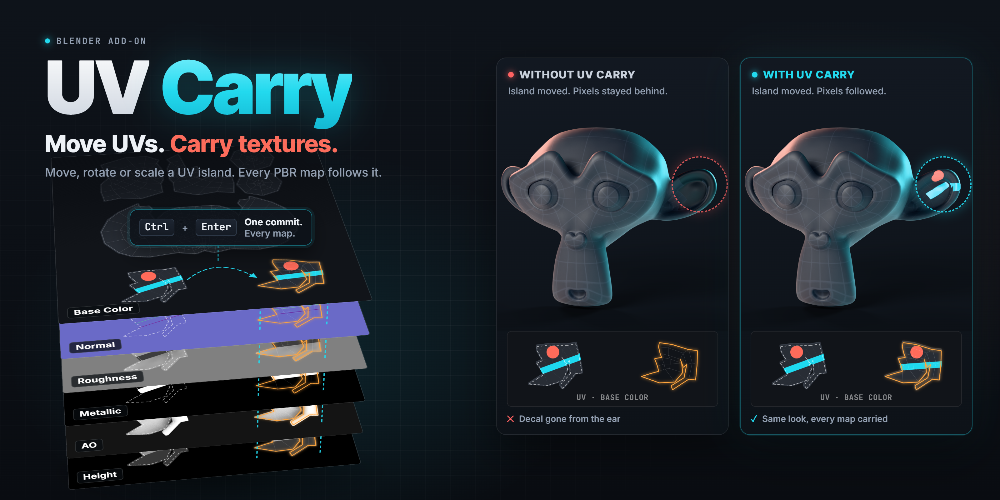
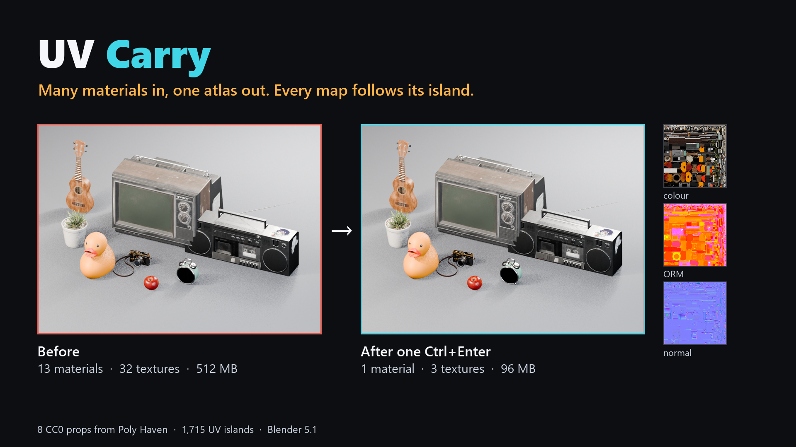
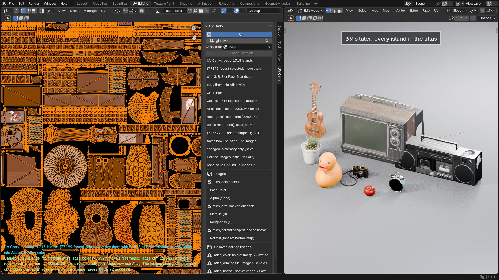
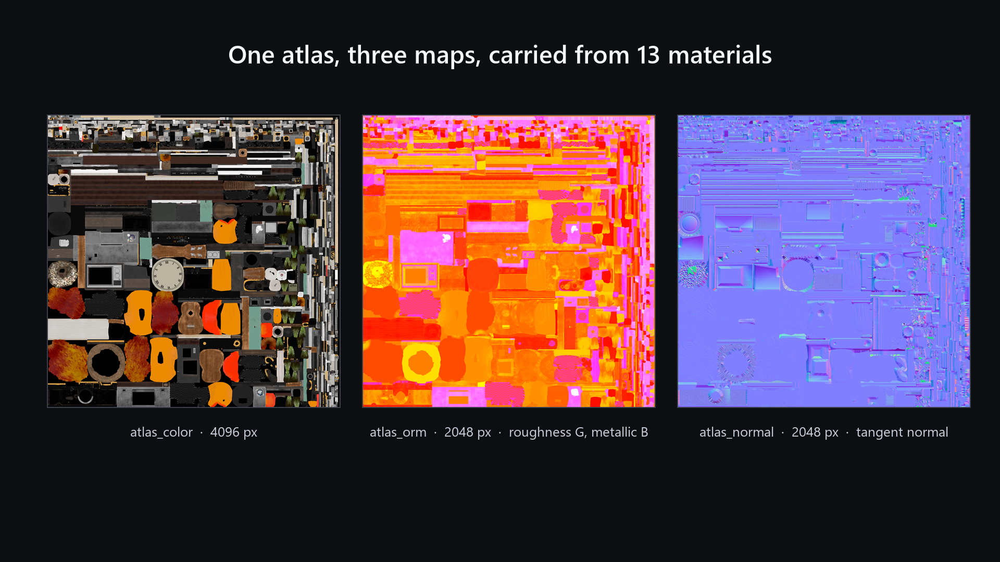
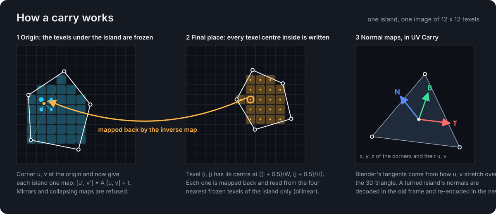

# UV Carry

**Move UVs. Carry Textures.**

[English](README.md) · Português (Brasil)

Um add-on do Blender 5.1 que mantém a textura junto dos UVs. Mova, gire, escale ou empacote ilhas UV com as ferramentas do próprio Blender, aperte `Ctrl+Enter`, e todas as texturas dos materiais acompanham. Junte as ilhas de vários materiais em um único atlas em um passo.

  
   
  <a href="assets/store/uv-carry-store.mp4"><b>▶ Assista ao vídeo</b></a> (77 segundos)

- **Suas ferramentas, seus atalhos.** G, R, S e UV > Pack Islands continuam do Blender. Nada é escrito enquanto você move; o trabalho na textura acontece uma vez, no `Ctrl+Enter`.
- **Todos os mapas de uma vez.** Cor, canais ORM empacotados, alpha e normal maps em tangent space, que mantêm o relevo quando a ilha gira.
- **Junte materiais em um atlas.** Defina um material como Carry Into, empacote as ilhas e aperte `Ctrl+Enter`: cada canal do atlas recebe o que o material de cada ilha dá a ele.
- **Várias ilhas de uma vez**, cada uma com o seu movimento. `Ctrl+Enter` sem movimento faz o padding das ilhas selecionadas.
- **Desfazer e salvar.** `Ctrl+Z` restaura os texels, os UVs e os materiais juntos; Save Carried Images grava as imagens alteradas, com um backup de cada arquivo.
- **Nada em silêncio.** O que não pode ser levado com exatidão é recusado antes de qualquer escrita, com uma mensagem que diz o material e a entrada.

## Em números

Oito objetos, levados para um atlas com um `Ctrl+Enter`:

| | Antes | Depois |
| --- | --- | --- |
| Materiais | 13 | 1 |
| Texturas | 32 | 3 |
| Memória de textura | 512 MB | 96 MB |
| Ilhas UV levadas | | 1.715 |

## Como funciona

O UV Carry guarda onde as ilhas começaram, deixa o Blender movê-las como sempre, e no `Ctrl+Enter` leva os texels de cada ilha de onde ela começou para onde ela terminou. Um movimento de texels inteiros é copiado bit a bit; rotações e escalas são reamostradas só dos texels da própria ilha, sem nada vazar de uma vizinha.

## UV Carry e UV Carry Lite

| | [UV Carry Lite](https://github.com/ghbanck/UV-Carry-Lite) | UV Carry |
| --- | :---: | :---: |
| Mover, girar e escalar ilhas com G, R e S | ✓ | ✓ |
| Várias ilhas de uma vez, e padding | ✓ | ✓ |
| UV > Pack Islands | | ✓ |
| Normal maps em tangent space | | ✓ |
| Carry Into: vários materiais em um atlas | | ✓ |

## Licenças

Em breve. Toda licença é o mesmo add-on, com todos os recursos, e inclui atualizações para sempre.

| Licença | Artistas | Internacional | Brasil |
| --- | --- | --- | --- |
| Individual | 1 | US$ 39 | R$ 59,90 |
| Small Studio | até 5 | US$ 99 | R$ 249,90 |
| Studio | até 15 | US$ 199 | R$ 599,90 |
| Production | até 50 | US$ 399 | R$ 1.499,90 |

O preço Brasil é para compras faturadas no Brasil. Um assento é uma pessoa, não uma máquina: sem ativação, sem servidor de licenças, sem trava de hardware. Cada versão é um zip versionado com o seu SHA-256, para um estúdio fixar a versão no próprio pipeline e voltar atrás. O UV Carry é licenciado sob a GPL, versão 3 ou posterior.

## Requisitos

Blender 5.1. Testado com o Blender 5.1.1 no Windows 11.

## Créditos

Os objetos das imagens e do vídeo são do Poly Haven (CC0): Television 01, Boombox, Camera 01, Alarm Clock 01, Rubber Duck Toy, Ukulele 01, Food Apple 01 e Potted Plant 04.

Copyright (C) 2026 Gustavo Banck.
